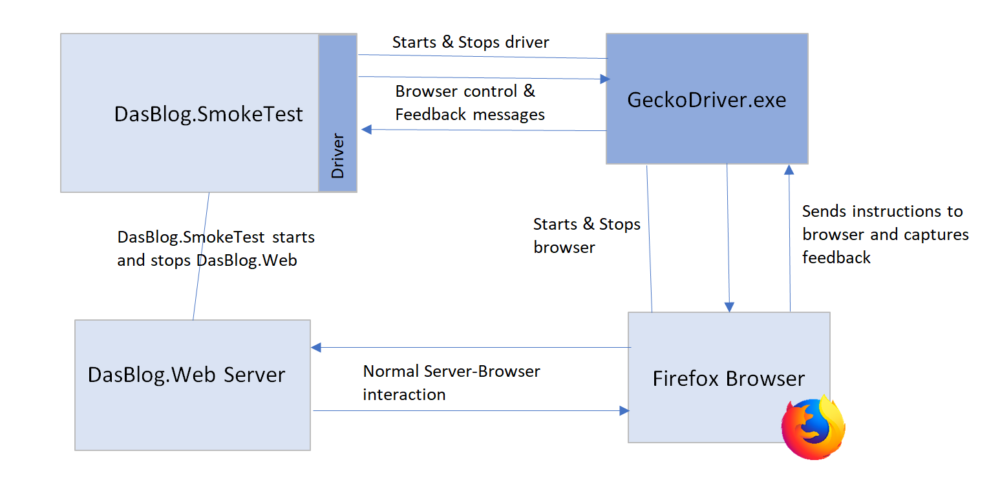

### Selenium Plus DasBlog-core in a Couple of Pages
* You need Firefox installed to use Selenium here

##### Use Cases
1. Smoke Test (see [readme.md](DasBlog.Tests/SmokeTest/readme.md) at DasBlog.SmokeTest)
2. [Functional Tests](DasBlog.Tests/FunctionalTests/FunctionalTests.md)

##### Configuration
Install Firefox - I imagine any recent version will do

Chrome, Edge, Safari and Opera are not supported here yet

Nothing is required from the Selenium site - I have had no requirement for the Selenium IDE
or the Selenium Server but of course no reason why not to grab the IDE.

No actual configuration is required.  DasBlog.SmokeTest and DasBlog.FunctionalTests are fully
set up to use Selenium.  Famous last words, so when you do find yourself
knocking up an installation (for a simple test case or whatever) have a look at
[DasBlog.Tests.Automation.csproj](DasBlog.Tests/Automation/DasBlog.Tests.Automation/DasBlog.Tests.Automation.csproj) which describes our slightly unconventional approach
to configuration

##### Resources
https://github.com/FeodorFitsner/selenium-tests

https://www.seleniumhq.org/

##### Rationale
Justification for functional tests is covered in [DasBlog Core, Issue 124, Measuring Test Coverage](https://github.com/poppastring/dasblog-core/issues/124)

As for the selected tool, Selenium seems to be the market leader at our desired price point.
If you've evaluated it in the past and thought it was too much trouble then the good news is it is 
much improved.  Simple to configure and use.

##### Selenium Architecture
Selenium has C# bindings in the form of an assembly running within the DasBlog test process,
beit DasBlog.SmokeTest or DasBlog.FunctionalTests.  Our tests call an API on the
FirefoxDriver object exposed
by this assembly and the FirefoxDriver assembly uses a wire protocol that we don't care about to communicate
with an external process (iteself called a driver, causing a certain amount of confusion).
In the case of Firefox, this is geckodriver.exe.  This driver controls the browser instance
targeted by our tests.  It starts and stops the browser and makes the automated manipulation happen
clicking buttons, returning text etc.

The only addition DasBlog-core makes to this is to add _running the web server_ as
part of the start up process.  This was not an essential design decision, the tests could
have easily operated against a permanently running version.  This approach was adopted for convenience.

#### Schematic of Relationships Between Components (Firefox Example)

See the [DasBlog Test Automation Guide](DasBlog.Tests/Automation/DasBlog.Tests.Automation/AutomationGuide.md) for
a description of how we interact with the Selenium components in our browser based tests and Smoke Test.
